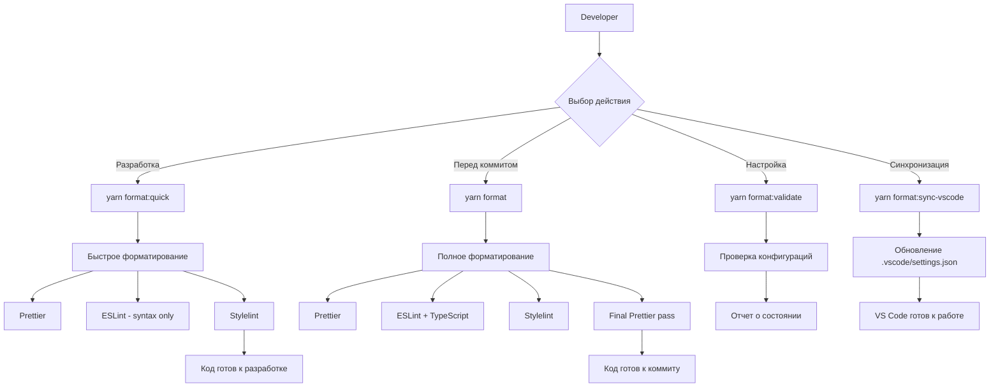

# Архитектура системы форматирования

## 📊 Диаграмма потока



## 🔧 Компоненты системы

### Конфигурационные файлы

```text
Project Root/
├── .config/
│   └── eslint-rules/
│       ├── index.js          # Основной экспорт правил
│       └── modules/
│           ├── common.js     # Общие правила (импорты, отступы)
│           ├── ts.js         # TypeScript правила
│           └── vue.js        # Vue-специфичные правила
├── .vscode/
│   └── settings.json         # Настройки редактора
├── eslint.config.js          # Конфигурация ESLint
├── stylelint.config.mjs      # Конфигурация Stylelint
└── .prettierrc.json          # Конфигурация Prettier
```

### Скрипты

| Скрипт               | Файл                   | Назначение        |
| -------------------- | ---------------------- | ----------------- |
| `format.sh`          | Полное форматирование  | Prod-ready код    |
| `format-quick.sh`    | Быстрое форматирование | Development       |
| `validate-config.sh` | Валидация              | Проверка настроек |

## 🚀 Workflow

### 1. Первоначальная настройка

```bash
# Клонирование проекта
git clone <repo>
cd mylara

# Установка зависимостей
yarn install

# Валидация конфигурации
yarn format:validate

# Синхронизация VS Code
yarn format:sync-vscode
```

### 2. Разработка

```bash
# Во время разработки (быстро)
yarn format:quick

# VS Code автоматически:
# - Форматирует при сохранении
# - Показывает ошибки ESLint/Stylelint
# - Применяет автофиксы
```

### 3. Перед коммитом

```bash
# Полное форматирование и проверка
yarn format

# Проверка, что все корректно
yarn format:validate
```

## 🎯 Интеграция инструментов

### Prettier

- **Запускается**: первым в любом процессе
- **Обрабатывает**: базовое форматирование кода
- **Конфигурация**: `.prettierrc.json`
- **Игнорирует**: файлы из `.prettierignore`

### ESLint

- **Запускается**: после Prettier
- **Обрабатывает**: качество кода, логику, импорты
- **Конфигурация**: `eslint.config.js` + `.config/eslint-rules/`
- **Режимы**: синтаксис (быстро) или полная проверка типов

### Stylelint

- **Запускается**: параллельно с ESLint
- **Обрабатывает**: SCSS/CSS файлы
- **Конфигурация**: `stylelint.config.mjs`
- **Возможности**: порядок свойств, именование, синтаксис

### VS Code

- **Настройки**: автоматически синхронизируются
- **Форматеры**: назначаются по типу файла
- **Автодействия**: форматирование при сохранении
- **Интеграция**: с ESLint, Prettier, Stylelint

## 📈 Производительность

### Кэширование

- `.eslintcache` - кэш ESLint
- `.stylelintcache` - кэш Stylelint
- `.prettierCache` - кэш Prettier

### Оптимизации

- Параллельная обработка где возможно
- Быстрый режим без проверки типов
- Игнорирование `node_modules`, `dist`
- Инкрементальные проверки

### Время выполнения (примерно)

- `format:quick`: 10-30 секунд
- `format`: 1-3 минуты (с проверкой типов)
- `validate`: 1-2 секунды
- `sync-vscode`: мгновенно

## 🔍 Troubleshooting

### Общие проблемы

1. **Медленное форматирование**
   - Используйте `format:quick` для разработки
   - Очистите кэши: `rm -f .eslintcache .stylelintcache .prettierCache`

2. **Ошибки конфигурации**
   - Запустите `yarn format:validate`
   - Проверьте наличие всех зависимостей

3. **VS Code не форматирует**
   - Запустите `yarn format:sync-vscode`
   - Перезагрузите VS Code
   - Убедитесь в установке расширений

4. **Конфликты между инструментами**
   - Prettier всегда запускается последним
   - ESLint настроен на совместимость с Prettier
   - Stylelint работает только с CSS/SCSS

### Отладка

```bash
# Проверка отдельных компонентов
npx prettier --check "src/**/*.ts"
npx eslint "src/**/*.ts" --config eslint.config.js
npx stylelint "src/**/*.scss" --config stylelint.config.mjs

# Проверка производительности
time yarn format:quick
time yarn format
```
